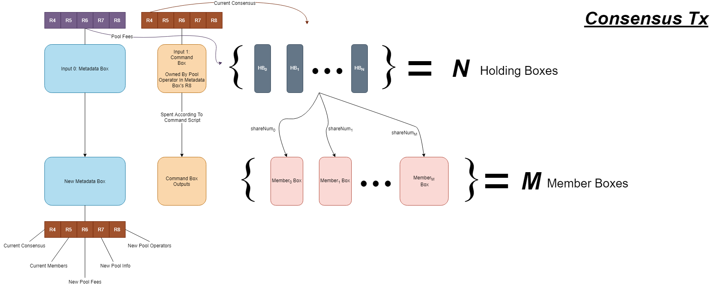

# Ergo SmartPool Contracts
This repository serves as an initial version for SmartPooling contracts.
These contracts will allow a mining pool to operate its payment processing on-chain, in
an open and honest way. The project was designed to be modular and to allow more complex
payment mechanisms to be built on top of it. 

The SmartPooling Contracts allow for an open and honest payment distribution system. Each payment will have
information about who received the payments, what numbers(in this case share numbers) the
payments were based on, and any fees present during the payment process.

In addition, key information about a SmartPool may be stored on-chain. The only required
information is the current epoch, current epoch-height, and the creation height of the
SmartPool. We define an Epoch to be one payment cycle that distributes ERG to the
members of the SmartPool.

The SmartPool contracts have been designed to work with 3 different scripts. This means
that each transaction that a SmartPool carries out requires 3 boxes at minimum:
The Metadata Box, The Command Box, and any number of Holding Boxes. We will get into more
depth in the following sections, but here is a general idea of the jobs of each box.

## Overview

*Metadata Box* - Stores information about the SmartPool and its last payout on-chain. 
In a consensus transaction, the Metadata Box's job is to verify that a new Metadata Box
is created, that the new Box's registers come from the Command Box, and that important
metadata is preserved. The Metadata Box also verifies that the Command Box is protected
by the proposition bytes of a script in the Pool Operators collection.

*Command Box* - The Command Box is a box that holds the registers representing
the new Metadata Box. The Command Box also holds information about the current consensus
in R4. During a consensus transaction, R4 of the command box is used to calculate the payout
that each member of the subpool receives. A Command Box's proposition bytes must be one of the
proposition bytes stored in the Pool Operators section of the current Metadata Box. This is the only
requirement for a command box and it allows any script to be used to protect the SmartPool. 
The open nature of the command box allows any number of verification schemes by the SmartPool.
For example, the simplest scheme would have a Command Box be the propositional bytes of some P2PK
Address. This would mean that any consensus transaction would have to be signed by the owner
of the private key encoded in the address. More complex schemes could have scripts that allow
voting or require tokens to create a valid command box. 

*Holding Box* - The Holding Box is the box that stores payout money until a consensus transaction
occurs. There may be any number of Holding Boxes in a consensus transaction so long as that number
is greater than one. The Holding Box has two mains jobs to perform in a consensus transaction. The
first job is to verify that Inputs 0 and 1 of the transaction are Metadata and Command boxes.
The second job is to verify that the consensus transaction outputs boxes that follow the consensus
stored in R4 of the Command Box. Another key part of the second job is verifying that pool fees
are paid and follow the exact pool fees laid out in the current Metadata Box. Pool Fees are not
calculated using the Command Box. Instead, the Command Box outlines the pool fees for the next epoch.
The Metadata Box outlines the Pool Fees to be used during the current epoch.

Every new epoch requires a new holding contract to be created. This is because every holding
box is linked to some instance of a metadata box during its creation. This ensures that
fake metadata boxes cannot be created to spend a holding box. 
This also ensures a unique line of metadata boxes from epoch 0 to the current epoch is always
available to analyze on the blockchain. Since each metadata box will contain information about the 
last consensus, we will have a complete payment history stored on the Blockchain for any third-party 
to verify a SmartPool's operation.

## [The Metadata Box](docs/MetadataBox.MD)
The Metadata Box is the box that stores information about the current SmartPool on-chain.
Each Metadata Box will hold key information in its registers that allows anybody to query
information about the SmartPool by searching for it on the Ergo Blockchain. Metadata boxes keep
information relating to the SmartPool, it's members, fees, operators, and the last share consensus
that created the metadata box. The metadata box also holds the Smart Pool NFT, which allows
the holding box to distinguish between SmartPool's and also gives an easy way for third parties
to search up history about a given SmartPool.

The metadata box may only be spent to create a new metadata box. In this way, we ensure that
there is an unbroken line of metadata boxes that transfer a certain SmartPool NFT from Epoch 0
all the way to the current epoch. The metadata box must also be spent with a command box. The reason
for this is that the command box is used as a template to copy registers from for the next metadata box.
The command box used must have it's propositonal bytes stored in the pool operators box in order to be spent.

The metadata box does not require that a holding box be present in the transaction. This allows pool operators to change settings
of the Smart Pool. Because of the holding box's contract, we are ensured that any money sent to it MUST be distributed to it's members properly. 

## The Command Box
The Command Box will have the same register layout as the Metadata Box. This is because
the registers present in the Command Box must be present in the new Metadata Box that
is outputted in the consensus transaction. Only two fields of the Command Box are used 
by the holding box in a transaction R4 and R5. R4 stores the current consensus information.
This information is then used by the holding box to verify that the outputs of the consensus
transaction follow the consensus provided. R5 of the command box is the member list. The only
constraint that the holding box provides for the member list is that all members of the current
consensus must be present in the member list. This ensures that all members of the SmartPool will
have their payment information on-chain. It also makes it easy to see who has been
added or removed by the command box during a consensus transaction.

The Command Box may be protected by any script so long as that script's propositional bytes are
stored in R8 of the Metadata Box. Since the command box is spent during the consensus transaction, it's
script must evaluate to true. What this means is that we may have additional constraints
that must evaluate to true before performing any consensus transaction.

Another important thing to note about the Command Box is that it's value is not calculated to be a part
of the total rewards. This allows for even more freedom in how the Command Box's funds is used.

## [The Holding Box](docs/HoldingBox.MD)
The Holding Box has no specific registers. Its main jobs are to verify that it is being spent
with a Metadata and Command Box, and that the transactions outputs follow the consensus laid out
in R4 of the Command Box and the Pool Fees in R6 of the Metadata Box.

Each holding box script is tied to a specific smart pool id on creation that represents some
smart pool NFT. The holding contract ensures that holding boxes may only be spent if 
`INPUTS(0)` represents a metadaat box with the given id. 

# The Consensus Transaction
This is the main transaction that distributes payouts to each SmartPool Member.
We may also refer to this transaction as a payout cycle or epoch. Each
transaction destroys an old metadata box and creates a new one with the same
value. The transaction also spends the command box according to the script protecting it.
All of the holding boxes are used to create boxes for each member, with values according
to the consensus given. The following diagram is a simplistic model of a 
consensus transaction. It assumes that there are no Pool Fees boxes to output to.

# Building Complex Payment Schemes On Top Of the SmartPool
The modular nature of the SmartPool allows for complex payment schemes to be used.

There are 3 different payment operations that may use any script to build more
complex payment schemes from.

### Pool Fees
Pool Fees are fees taken out of the total payout before it is distributed. Pool
fees may take a minimum of 0.1% or (0.001 * totalPayout). We may use pool fees
to tax money from all members of the SmartPool. The simplest form of a pool fee
would be the proposition bytes for some P2PK address owned by a pool operator.
Such a pool fee could be used to offset upkeep costs for hosting the stratum server.

More complex scripts could also be used. For example, if a mining pool wished
to create a community developer fund, it could create a script that holds ERG until
a public key of some developer is passed to it. The mining pool may then add the 
proposition bytes of this script to the SmartPool's pool fees. Every consensus
transaction would take some percentage of the total rewards and store it in the
developer fund. At the end of every month, members may vote on which developer
gets the fund. The SmartPool operator may then pass the public key of the developer
to the Smart Contract, which will ensure a box owned by the developer is created
and has the correct value.

### Member Payouts
Member Payouts are the output boxes of each consensus transaction whose value
was determined by the holding box script. We may use Member Payouts to give ERG
to specific members or scripts representing members. As with the other payment schemes,
the simplest form of payment would be to some P2PK address.

We may use Member Payouts to create multiple levels of decentralized payments. For example, we may
create subpools of miners that decide how their own payment is distributed using a vote system. The only
thing that the SmartPool does is transfer ERG to each of its direct children/members.
These subpools would allow miners to dictate how they each individually get paid.

We may also use scripts that allow SmartPool members to receive tokens,
lock funds, or more.

### Command Box
The Command Box allows us even more flexibility in payment schemes. The Command Box
will allow SmartPool Operators to inject extra funds into the SmartPool to perform more complex
payment mechanisms. Another important part of the Command Box is that it
is inherently spent in the consensus transaction. Unlike the member payouts
and pool fees, this means that the Command Box directly affects whether or not
a valid consensus transaction may occur. 

## This project is made using Ergo-Appkit
You can find it here: https://github.com/ergoplatform/ergo-appkit

## This project is based on work from ErgoSmartPools
https://github.com/WilfordGrimley/ErgoSmartPools
