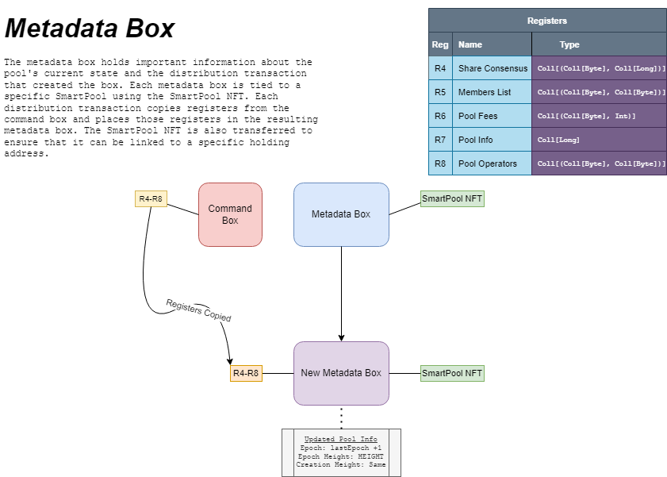

# The Metadata Box

The metadata box represents a crucial part of every distribution transaction. We may consider the metadata
box to be the "head" of the smart pool. Any time information about a smart pool is retrieved from on-chain
it will be from one of the registers on the metadata box. The metadata box also ensures that it may only 
be spent with a valid command box under its pool operators register.

## Register 4: Share Consensus
In register 4 of the command box, we will store a `Coll[(Coll[Byte], Coll[Long])]` that maps the proposition bytes of members
to various information about each member's value obtained during the consensus, stored as a `Coll[Long]`. 

Each element of
- Elem 0: Number of shares in this distribution tx
- Elem 1: Member's minimum payout for this distribution tx.
- Elem 2: The new value owed to this member after consensus. If this value is bigger than the minimum payout
then it was paid out in the distribution tx. This will cause the number to restart at a value of 0 ERG for the
next distribution tx.

Elements 3+ are not checked in the standard distribution transaction. They may be used by the command
box or by the holding box for additional payment mechanisms.

## Register 5: Members List
Register 5 of the metadata box holds the Members List. The Members List maps the propositional bytes of
each Pool Member in the share consensus to an ASCII encoded collection of bytes that represents the address
string. The address string's validity is not checked by any smart contracts, and is purely there to help
observers understand which address is which in a distribution tx.

## Register 6: Pool Fees
Register 6 of the metadata box stores the pool fees. Pool fees are a `Coll[(Coll[Byte], Int)]` that map
the propositional bytes of various fee addresses to some percentage of the total holding value. Pool fees
are calculated to be `(x/1000)*TOTAL_HOLDING_VALUE` where x is the integer number that the proposition
bytes of the fee map to. This means that each pool fee can take a minimum of 0.1% of the total holding value.

## Register 7: Pool Info
The metadata box's info and parameters can be seen in register 6, which holds a `Coll[BigInt]` that gives
information about the Smart Pool's current state. Here is the required information inside each pool info
collection:
- Elem 0: The current pool epoch. This value must increase by 1 during every distribution transaction.
- Elem 1: The epoch height. This is the height that the current epoch started. This height must update everytime
distribution transaction occurs.
- Elem 2: The creation height. This is the height at which epoch 0 started for this Smart Pool. This value
must stay the same in each distribution transaction.
- Elem 3: The creation box id. This is the id of the first metadata box with epoch 0. This value
must stay the same in each distribution transaction. This value is equal to the value of the
Smart Pool NFT's Id.

Elem 4+ are not checked in the distribution transaction. They may be used by the command box to store
other info for other payment mechanisms.

## Register 8: Pool Operators
The pool operators collection is stored in register 7. It is a `Coll[(Coll[Byte], Coll[Byte])]` that maps
the propositional bytes of command boxes to the address. The address field is not checked on-chain and is
only there so that people can verify that the prop bytes stored in the pool operators box is the prop
bytes for the address that it is mapped to.

The pool operators list is used by the holding box and by the metadata box to verify that the command box
being used is under a valid script. 